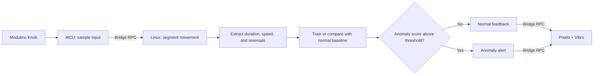

# QC UNO Q Workshop 202: Anomaly Dial

As part of this workshop, attendees will turn the `101-Haptic Dial` into a personal edge-AI interface that learns normal movement and detects anomalies.

The app interacts in the following manner:

- The MCU samples the Knob Modulino and drives the Pixels and Vibro Modulinos.
- The Linux MPU turns recent knob movement into duration, speed, and direction-change features.
- Attendees record ten examples of normal turning and train a small baseline model locally.
- The trained model flags unusual movements through light and haptic feedback.

All inference is local and does not depend on internet connectivity!

> [!IMPORTANT]
> This is a `201`-level workshop. Attendees should already be comfortable running an App Lab project and understand the MCU, MPU, and Bridge roles introduced in `101`.
>
> Complete the software prerequisites before arriving. Downloading App Lab or board software during the session will cause delays and may prevent you from keeping up with the build.

## Session Prerequisites

1. Complete or review [`101: Haptic Dial`](../101-haptic-dial/).
2. Install [Arduino App Lab](https://www.arduino.cc/en/software/#app-lab-section).
3. Clone this repository using `git clone https://github.com/aaishikasb/uno-q-workshops.git` in your terminal.

The collection and training flow will be familiar if you have completed [`201: Gesture Dial`](../201-gesture-dial/), but it is not required.

## Hardware Setup (Provided On-site)

### Required Hardware

- Arduino UNO Q
- Modulino Knob
- Modulino Pixels
- Modulino Vibro
- 3 Qwiic cables
- USB-C cable

### Wiring

Chain the Modulinos with Qwiic:

```text
UNO Q Qwiic -> Modulino Knob -> Modulino Pixels -> Modulino Vibro
```

The order is not important for I2C, but using the same order makes debugging easier.

After connecting all Modulinos, connect the UNO Q to your computer with USB-C.

## App Lab Setup

1. Open Arduino App Lab.
2. Select your UNO Q board.
3. If the `Updates` modal appears, **DO NOT** update the board firmware during the workshop.
4. Open **My Apps**.
5. Import `workshop-app.zip` from this directory.
6. Open the imported `UNO Q Anomaly Dial` app.
7. Confirm these files are present:
   - `app.yaml`
   - `python/main.py`
   - `python/anomaly_model.py`
   - `sketch/sketch.ino`
   - `sketch/sketch.yaml`
8. Click `Run` in the top-right corner.
9. Keep the App Lab output panel visible. It tells you when to record and whether an example was accepted.

App Lab compiles and flashes the MCU sketch, then starts the Python runtime on the UNO Q Linux side. The Vibro pulses once during startup.

## Train Your Dial

The first run collects ten examples of normal movement:

1. Turn smoothly in one direction for about one second.
2. Use roughly the same speed and duration across examples, with small natural variations.
3. Turn at least six knob steps per example. Either direction is fine; direction itself is not a feature.

For every example:

1. Check the App Lab output for the example number.
2. Press and release the knob.
3. When all eight Pixels turn white, perform the movement.
4. Stop moving and wait for the short confirmation pulse.

Recording finishes after 0.3 seconds without movement, or after four seconds of movement. Start within five seconds of releasing the button. If there is not enough movement, the Pixels turn amber and the app asks you to retry the same example. Pressing the knob during recording cancels that example; releasing it starts a fresh recording.

Training colors show the current state and progress:

| Color  | Meaning                                                                |
| ------ | ---------------------------------------------------------------------- |
| Pink   | Record normal examples                                                 |
| White  | Recording is active                                                    |
| Purple | Fit the baseline model                                                 |
| Amber  | Not enough movement; retry the example                                 |
| Blue   | The trained dial is live                                               |
| Green  | Movement is within the learned baseline                                |
| Red    | Movement is anomalous, or a saved-model reset failed; check the output |

The number of pink Pixels shows collection progress. At least one stays lit while waiting; the App Lab output gives the exact example count.

## Use The Trained Dial

After the tenth example, the Linux application trains and saves the model, the Pixels turn blue, and the dial enters live inference mode.

Turn the knob without pressing it. When motion stops:

- Green indicates movement similar to the normal examples.
- Red and a haptic pulse indicate an anomaly.
- More lit Pixels indicate a larger deviation from the baseline, reaching all eight at twice the anomaly threshold.

Try these movements after training with smooth, one-second turns:

1. Turn much faster than usual.
2. Turn back and forth repeatedly instead of moving in one direction.
3. Keep turning steadily for three to four seconds.

Continuous movement is scored in windows of up to four seconds. Movements shorter than six knob steps are ignored. These experiments are relative to your baseline: an action included in training may be considered normal.

Watch the App Lab output to see `NORMAL` or `ANOMALY`, the anomaly score, the feature with the largest deviation, and the measured motion features. The score is a distance from normal, not a probability or confidence percentage.

Hold the knob down for three seconds to erase the saved model and repeat training. Release it, then press and release again to record the first new example.

## How The Demo Works



### MCU Responsibilities

- Read the knob position and button state.
- Render training, recording, normal, anomaly, and error states on the Pixels.
- Generate haptic feedback for training and anomaly alerts.
- Expose hardware services to Linux through Bridge.

### Linux MPU Responsibilities

- Poll the knob with a 50 ms delay between iterations and timestamp the readings.
- Detect when a movement starts and ends, using the same capture logic for training and inference.
- Trim leading and trailing inactivity from the feature calculations.
- Calculate duration, mean speed, peak sampled speed, and direction reversals.
- Learn the mean and standard deviation of each feature from normal examples.
- Flag movements whose largest standardized deviation exceeds the threshold.
- Save the model to `data/anomaly_model.json`.

## The Model

This workshop uses a statistical anomaly detector implemented with the Python standard library. Each movement becomes four numbers. Training learns their average values and variation from normal examples; it does not need examples of every possible anomaly.

For each feature, the detector calculates:

```text
deviation = abs(observed value - training mean) / scale
scale = max(training standard deviation, minimum scale)
anomaly score = largest feature deviation
anomaly = score > 3.0
```

Minimum scales keep nearly identical training examples from making the detector oversensitive. In `python/anomaly_model.py`, `MINIMUM_SCALES` follows this order: duration in seconds, mean speed in steps/second, peak speed in steps/second, and reversal count. Adjust these tolerances or `ANOMALY_THRESHOLD` when experimenting with the physical dial.

The intentionally small model makes the complete edge-AI loop visible:

```text
collect normal examples -> represent -> train -> score -> evaluate -> act
```

The baseline stays fixed until you retrain. This makes behavior changes and false alarms visible. Features are evaluated independently, so unusual combinations of otherwise normal values can be missed. This is a condition-monitoring exercise using knob movement as the input; it does not measure an actual machine fault.

## Suggested Experiments

- Record consistent examples, then retrain with varied speeds and durations. Compare which movements trigger alerts.
- Test ten fresh normal turns and count false alarms. Test ten deliberately unusual turns and count missed anomalies.
- Swap dials with a partner and test how well each personal baseline generalizes.
- Change `ANOMALY_THRESHOLD` from `3.0` to `2.0` or `4.0` and compare false alarms against missed anomalies.
- Gradually change your turning speed after training to explore drift, then retrain with the new behavior.
- Compare the learned baseline with a hand-written speed threshold. Identify anomalies that each approach misses.

## Troubleshooting

### The app keeps rejecting training examples

- Start moving within five seconds of the Pixels turning white.
- Make the movement large enough to produce at least six knob steps.
- Turn smoothly for about one second, then stop and wait for confirmation.

### Normal movements frequently trigger alerts

- Make the movement similar to your training examples.
- Use App Lab output to identify the feature causing the alert.
- Hold the knob for three seconds and retrain with representative normal movements, or increase the anomaly threshold slightly.

### The app skips training when restarted

The trained model is intentionally persistent. Hold the knob for three seconds while the app is live to delete it and begin again. If the model could not be saved, the app reports that in the output and continues with the model in memory for the current session.

### Unusual movements are reported as normal

The baseline may already include similar movements or have a wide spread. Retrain with a more consistent normal pattern, lower the anomaly threshold, or inspect the feature and scoring code in `python/anomaly_model.py`. Keep back-and-forth motion slow enough to be sampled; movement between polls can be missed.

## Files

- `workshop-app/`: App Lab project source
- `workshop-app/python/main.py`: interaction, capture, and inference state machine
- `workshop-app/python/anomaly_model.py`: feature extraction, training, scoring, and persistence
- `workshop-app/sketch/sketch.ino`: MCU hardware services and feedback
- `workshop-app.zip`: importable App Lab project
- `test_anomaly_dial.py`: runnable regression check using simulated samples and Bridge calls

Run the software check from the repository root with `python3 -B 202-anomaly-dial/test_anomaly_dial.py`. Board compilation, App Lab import, I2C communication, and physical feedback still need an on-device check.

## Sources

- Arduino UNO Q hardware docs: https://docs.arduino.cc/hardware/uno-q
- Arduino App Lab docs: https://docs.arduino.cc/software/app-lab/
- Arduino Bridge guide: https://docs.arduino.cc/software/app-lab/bridge/get-started-with-bridge
- Arduino Bridge API: https://docs.arduino.cc/software/app-lab/bridge/bridge-api
- Arduino App structure: https://docs.arduino.cc/software/app-lab/apps/about-apps
- Arduino Modulino library: https://docs.arduino.cc/libraries/arduino_modulino
